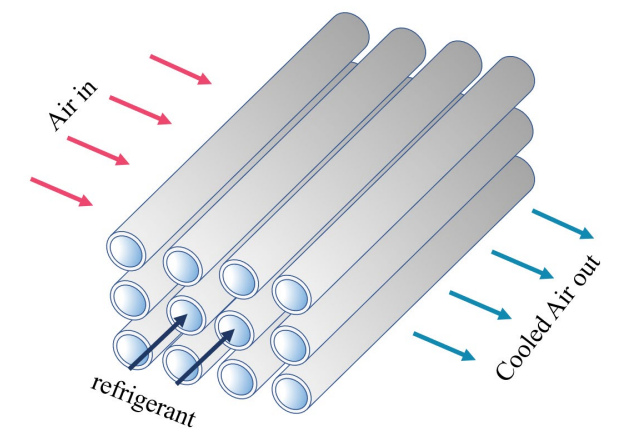

# Cross flow heat exchanger: Tube banks
This repository contains the **Ansys Fluent** simulation files delivered for the final project of the course *Heat Transfer* lectured by *Dr. Ehsan Houshfar*. In this project, a cross flow heat exchanger with staggered arrangement is being modeled by ANSYS Fluent once 2-dimensionally and once 3D. Then the reliability of their results is investigated via theoretical and experimental equations. The following figure shows this heat exchanger inside an evaporator; so that the refrigerant fluid with a constant temperature is turned into saturated vapor and the air passing through the pipes is used for cooling and air conditioning.

# Steps
Modeling of this system with thermal and hydrodynamic analysis is done using Fluent software. The steps of modeling are summarized below:

- The initial geometry design is done using *Design Modeler* in Ansys software.
- After obtaining the geometry, in the Ansys *Meshing* environment, the finite volumes are created.
- The obtained meshed geometry is entered into the *Fluent* environment and the problem is solved using appropriate initial and boundary conditions as well as a justifiable solution method.